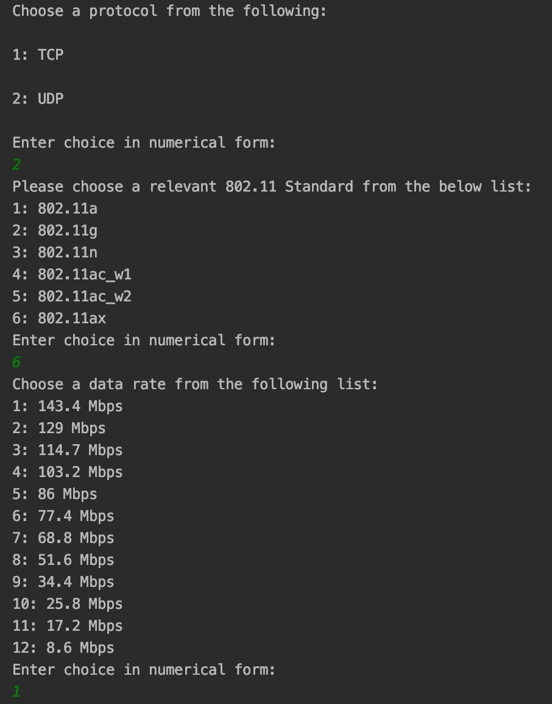
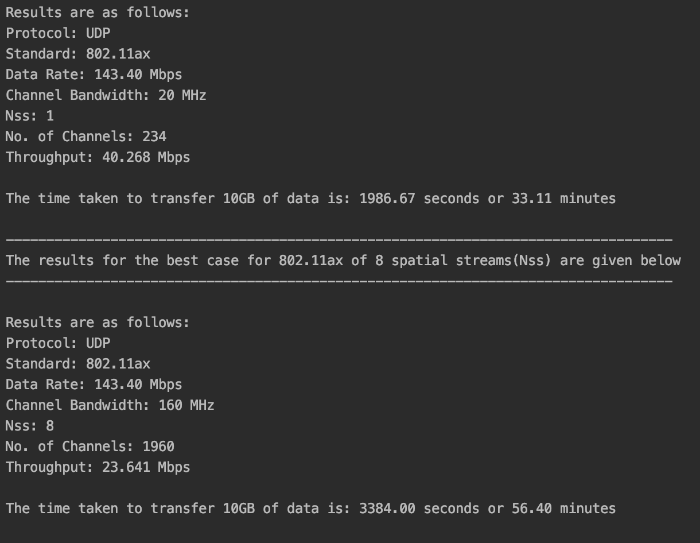

# Advances in Wireless Networking COMP40660
## Assignment 1: 802.11 Throughput
### Robert Keenan 15333066

### Design/File Structure and Usage
In this Assignment, I was tasked to build a throughput calculator for a number of 802.11 Wi-Fi standards from 802.11a all the way to 802.11ax. 
The program takes input of the protocol the user wants to use (TCP or UDP), the 802.11 standard they wish to use
and then the corresponding data rate of that 802.11 standard. 

I must output the calculated throughput for the chosen protocol and 802.11 standard for a data rate at 20MHz, 1 Spatial Stream 
which will be referred to as the "Normal" case and then the "Best" case for this data rate will be using the maximum number of spatial streams and channels for the maximum channel bandwidth.

#### Design 
The project is laid out in a structure making use of 3 Python files, this README as well as some screenshots of the terminal readouts from the screen to the user.
I tried to make the main.py file as clear as possible. More functions could have been used to calculate different values such as the transmission time but
I felt for this assignment it would be easier to leave out that layer of abstraction and clearly show in the main() method how different quantities are calculated. 
The 3 Python files are described below (config.py, main.py, func.py)

- **main.py** is the main Python file which handles the function calls to user I/O functions, the calculation of transmission duration/eventual 
throughput and prints to the screen. I decided to keep the throughput calculation out of a function as it is easier for a user to see where 
each value and result arises from. 

- **func.py** is used for some simple user input and output. These functions include printing information to the screen such as
the 802.11 standards' data rates. It also has a function which handles all the user input in terms of choosing protocols,
standards and data rates.

- **config.py** is used to hold all of the 802.11 standard information from MAC Header sizes, SIFS, Preambles and other data rate
specific data. This data is used for all of the calculations and this makes sure that the program is as interchangeable and usable to multiple people. They only need
a specifically setup configuration file and all of the program's source code should work interchangeably with new data types. It is also easier to keep this file self contained with the dictionaries
so the information can be easily accessed using a number of Python methods. 

#### Usage
First of all, if you press "RUN" on your IDE such as Pycharm in main.py or run via the command line using `python3 main.py` you should be prompted with the following read-outs to the terminal:
-  You will first be prompted to enter a number stating your choice of protocol of either TCP or UDP (1 or 2)
followed by pressing "Enter". 
- Then choose a relevant 802.11 standard from the list shown on the screen (e.g., 1 : 802.11a) by entering a relevant numerical choice and pressing "Enter".
- Choose a data rate for this chosen 802.11 standard from the list shown on the screen for the 20MHz, 1SS "Normal" case. 
- The result will be printed to the screen for the throughput (for 1500 byte Data packet) and the time taken to transfer 10GB of data for both
the "Normal" case and the "Best" case. 

The case shown below is for UDP, 802.11ax and a 143.4 Mbps data rate. 

### Why is there a difference between the actual throughput and the advertised data rate?
The answer to this question lies with the amount of overhead required to send a simple 1500 byte data packet at a given advertised data rate.
For each advertised data rate, the number of bits per OFDM symbol, number of channels and bits all change thus representing a different result every time between seemingly very close data rates.
We can also see the amount of overhead or extra items needing to be transmitted with the data packet such as CTS, RTS, ACKs and Preambles. We also have to take account for all of the delays 
placed in the channel such as DIFS, SIFS and in the case of 802.11g, a signal extension. Encapsulating the data frame with a MAC Header and SNAP LLC headers also adds to the total transmission time as well as OFDM tail bits. 

In the case of TCP, you are transmitting a lot more overhead and data as you need a whole data stream for the TCP ACK and you can also not transmit again until the
TCP ACK has been received and acknowledged. This obviously results in a lower throughput than the advertised data rate. We can actually increase the data packet size also and this will result in a decrease in the amount of overhead required. 
Another case is with the improving standards, each duration in terms of symbol duration and number of bits per symbol (NBits * CRate * NChan * Nss) has increased as seen by the calculations in the notes. Using a small data frame 
of only 1500 bytes affects the throughput as there is so much more time/overhead required to send a small 1500 byte packet. Each item for calculating the transmission duration increases through the more recent 
standards, hence the quite poor performance. 
This is seen by results such as the one above where the advertised rate at 802.11ax is 143.4Mbps but we are only achieving 23.33Mbps. 

### 802.11 performance improves after each release. Briefly discuss the trade-offs involved in such improvements. 
Some of the improvements in 802.11 standards over recent years are higher reliability, larger bandwidths and more channels to transfer data on as well as supporting MIMO and MU-MIMO (Multi user MIMO).
There have also been improvements to support both 2.4GHz and 5GHz in terms of WLAN frequency. The trade-offs for these improvements mainly lie in the range and coverage of the improving standards 
which are in turn influenced by the transmit power. More power is needed to be used to transmit at the much higher rates advertised. This obviously means that such Access Points or Wireless devices 
must either be connected to a Mains power connection or have a very large battery to be used. As the standards have improved and such improvements such as 802.11n to 802.11ac with MIMO to MU-MIMO,
the channels suffer from interference and noise from adjacent channels and co-channels between multiple users. 
More thought and care must be taken when locating cells or APs close to each other so as to not cause large amounts of interference resulting in packet loss and lower throughput. 
Another trade off relates to what I said in the previous answer regarding the long durations for quite small size data frames of 1500 bytes and how this affects the throughput. 

